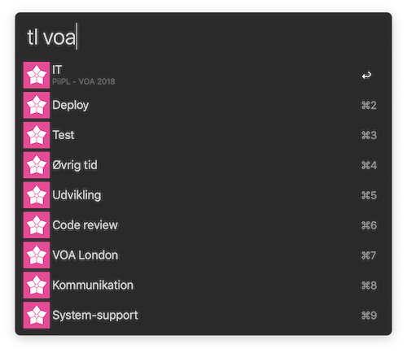

# TimeLog Workflow for [Alfred 3](https://www.alfredapp.com)

Start tracking time in [TimeLog](https://www.timelog.com/en/) with a quick `tl` command at your fingertips :watch:

### Installation

1. [Download](https://github.com/mathiasjakobsen/alfred-timelog/releases) latests release
2. Double-click the `timelog.alfredworkflow` package to install
3. Run the `timelog login` command, with your TimeLog credentials, to log in
4. Start tracking time, without Microsoft Silverlight. Great success :tada:

### Commands

- `timelog login` will log in on your TimeLog account. Required for workflow to work.

- `tl` will display active task being tracked, if any. Otherwise, just a placeholder.

- `tl [query]` will fuzzy search your tasks. Hit enter on a task to start tracking time on that task.
